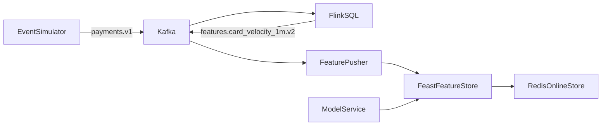

# Streaming Fraud MLOps (Step 1)

Local Kafka + Flink + Feast + Redis demo for real-time fraud features.

## Prereqs

- Docker Desktop
- Python 3.10+

## One-command demo (Phase 3 + Phase 4)

Runs an end-to-end smoke test:

- brings up the stack
- calls `model-service` `/predict` + `/metrics`
- produces `payments.v1` events and verifies `decisions.v1`
- runs `drift-check`

```bash
make demo
```

## CI (GitHub Actions)

Workflow: `.github/workflows/ci.yml`

- Runs `make demo` on every push / PR (end-to-end smoke test using Docker Compose).

## Start Kafka + Schema Registry

```bash
cd "/Users/rajveersinghkalra/Desktop/ml-ops/streaming-fraud-mlops"
docker compose up -d
```

Schema Registry will be available at `http://localhost:18081` (we use 18081 to avoid conflicts with other local services).

## Run the validator consumer (validates schema, writes to DLQ)

```bash
python -m venv .venv
source .venv/bin/activate
pip install -r services/validator-consumer/requirements.txt
python services/validator-consumer/consumer.py
```

## Run the event simulator (producer)

In another terminal:

```bash
source .venv/bin/activate
pip install -r services/event-simulator/requirements.txt
python services/event-simulator/producer.py --rate 5000 --seconds 30 --burst-rate 10000 --burst-seconds 10
```

## Sustained throughput test (10k events/sec)

We tune `payments.v1` to **12 partitions** for throughput.

```bash
docker compose exec -T kafka kafka-topics --bootstrap-server kafka:29092 --alter --topic payments.v1 --partitions 12
source .venv/bin/activate
python services/event-simulator/producer.py --rate 10000 --seconds 60
```

On this machine, we observed:

- **~600k events / 60s** sustained at 10k eps (single producer process)

## Topics

- `payments.v1`: raw payment events (JSON for now)
- `payments.v1.dlq`: invalid events (JSON payload with error + raw)
- `decisions.v1`: real-time fraud decisions (JSON)

## Feature consistency demo (Flink -> Kafka -> Feast -> Redis -> online lookup)

This is the core “MLOps gold” flow: streaming features written to an **online store** (Redis) through **Feast**.

### Architecture (local)



### Run it

1) Bring the stack up:

```bash
docker compose up -d
```

2) Produce events long enough to cross a 1-minute window:

```bash
source .venv/bin/activate
python services/event-simulator/producer.py --rate 2000 --seconds 70
```

3) Pick a `card_id` from the feature topic:

```bash
docker compose exec -T kafka kafka-console-consumer \
  --bootstrap-server kafka:29092 \
  --topic features.card_velocity_1m.v2 \
  --consumer-property auto.offset.reset=earliest \
  --max-messages 1 --timeout-ms 20000
```

4) Query online features (Feast reads from Redis):

```bash
docker compose exec -T feature-pusher bash -lc "export CARD_ID=card_65759; python query_online.py"
```

Expected output shape:

```text
{'card_id': ['card_65759'], 'txn_count_1m': [1], 'amount_sum_1m': [30.14]}
```

### LinkedIn-ready bullets

- Streaming pipeline: **Kafka + Flink** computes windowed velocity features in real time
- Feature store: **Feast + Redis** for low-latency online feature retrieval (training/serving consistency path)
- Throughput: validated **10k events/sec** sustained producer locally (see benchmark above)

## Phase 1: Model training + MLflow registry

We train a baseline fraud model using:

- **Offline dataset**: `feature_repo/data/payments_v1.parquet` (synthetic historical payments + labels)
- **Offline features**: `feature_repo/data/card_velocity_1m_v1.parquet` (windowed velocity features)
- **Feature join**: Feast `get_historical_features(...)`
- **Experiment tracking + registry**: MLflow (tracking UI + model registry)

### Start MLflow

```bash
docker compose up -d mlflow
```

Open MLflow UI at `http://localhost:15000`.

### Run training (Docker, reproducible)

```bash
docker compose run --rm model-training
```

Expected output (example):

- Creates experiment `fraud_detection`
- Registers model `fraud_model` with version `1`

## Phase 2: Real-time model serving (FastAPI + MLflow + Feast online features)

The model service exposes:

- `GET /health`: basic service status
- `POST /predict`: fetches **online features** from Feast/Redis, loads the latest registered model from **MLflow Model Registry**, and returns a fraud probability + decision.

### Start model service

```bash
docker compose up -d model-service
```

Health check:

```bash
curl -sS --http1.1 -H 'Connection: close' "http://localhost:18000/health"
```

Example prediction:

```bash
curl -sS --http1.1 \
  -H 'Content-Type: application/json' \
  -H 'Connection: close' \
  "http://localhost:18000/predict" \
  -d '{"card_id":"card_65759","amount":123.45}'
```

Expected output shape:

```json
{"card_id":"card_65759","fraud_probability":0.0039,"decision":"approve","model_version":"2"}
```

## Phase 3: Streaming inference (Kafka consumer -> model-service -> decisions topic)

This connects the stream to real-time scoring:

`payments.v1` → `realtime-inference` → `model-service` (Feast online features + MLflow model) → `decisions.v1`

### Start realtime inference

```bash
docker compose up -d realtime-inference
```

### Produce events (quick demo)

```bash
source .venv/bin/activate
python services/event-simulator/producer.py --rate 200 --seconds 5
```

### Watch decisions

```bash
docker compose exec -T kafka kafka-console-consumer \
  --bootstrap-server kafka:29092 \
  --topic decisions.v1 \
  --from-beginning \
  --max-messages 3 --timeout-ms 20000
```

## When to deploy to AWS (and how to keep it cheap)

Deploy once you have a **full end-to-end story locally** (Phase 3) and can demo it in 2–3 minutes. Before that, cloud time is mostly spent debugging networking and IAM rather than showing MLOps.

### Recommended milestones

- **Deploy after Phase 3**: streaming inference is end-to-end and cloud-ready.
- **Even better after Phase 4 (light monitoring)**: basic metrics/logging makes it look “production”, not a toy.

### Cost-safe strategy (important for a ~$50/mo budget)

Managed AWS components like **MSK + Managed Flink + ElastiCache** usually cost **much more than $50/mo if you leave them running 24/7**.

Best approach:

- **Keep local as the always-on dev environment**
- **Spin up AWS only for short demo windows** (hours), then tear down
- Capture screenshots + a short Loom/video for LinkedIn

### What we’ll deploy (later cloud phase)

- **Kafka**: AWS MSK (or MSK Serverless for demos)
- **Streaming features**: Managed Service for Apache Flink
- **Online store**: ElastiCache Redis
- **Model serving**: ECS/Fargate (or EKS if you want Kubernetes)
- **Model registry**: MLflow (self-hosted on ECS/EKS + S3 for artifacts)

## Phase 4: Monitoring + drift basics (Prometheus + Grafana + PSI report)

### Start monitoring stack

```bash
docker compose up -d prometheus grafana
```

- Prometheus UI: `http://localhost:19090`
- Grafana UI (anonymous enabled): `http://localhost:13000`

### Generate some traffic

If you already have Phase 3 running, just produce a small batch:

```bash
python services/event-simulator/producer.py --rate 200 --seconds 5
```

### Useful Prometheus queries

```text
model_service_predictions_total
rate(model_service_requests_total{endpoint="/predict",status="ok"}[1m])
histogram_quantile(0.95, sum(rate(model_service_predict_latency_seconds_bucket[1m])) by (le))
```

### Alert rules (Phase 4.1)

We ship basic Prometheus alert rules in `monitoring/alerts.yml`. To load them:

```bash
docker compose up -d --force-recreate prometheus
```

Then open Prometheus → **Alerts**:

- `http://localhost:19090/alerts`

### Run a drift check (PSI)

This compares recent live traffic (prediction logs) vs the training/offline distributions:

```bash
docker compose run --rm drift-check
```

## Phase 6: Evaluation pipeline (delayed labels)

Evaluates the **Production** model offline using:

- real dataset: `feature_repo/data/payments_real.parquet`
- Feast historical features (same definitions as training)
- delayed labels simulation: only evaluate rows older than `LABEL_DELAY_MINUTES`

Run evaluation:

```bash
docker compose run --rm evaluation
```

You should see an `EVAL_RESULT ...` JSON line and the results logged to MLflow experiment `fraud_evaluation` (UI: `http://localhost:15000`).

## Phase 6.1: Production-grade evaluation (event_id + delayed labels)

This is the “real world” evaluation loop:

- predictions sink: `services/model-service/logs/predictions_eventid.jsonl` (written by `model-service`)
- labels sink: `services/model-service/logs/labels.jsonl` (written by `label-simulator` with a delay)
- join key: `event_id`
- integrity: the evaluation job fails if any `event_id` can’t be joined (unless explicitly allowed)

Run:

```bash
docker compose up -d model-service realtime-inference label-simulator
docker compose up -d event-simulator
docker compose run --rm evaluation-eventid
```

Notes:

- `LABEL_DELAY_SECONDS` (label-simulator) controls the delay (demo default is small).
- `LABEL_GRACE_MINUTES` (evaluation-eventid) prevents evaluating “too fresh” predictions that may not have labels yet.

