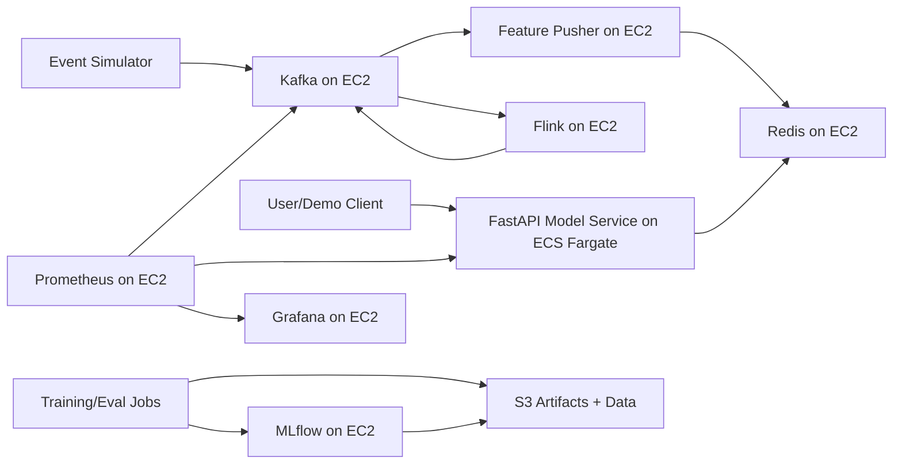

## AWS Dry-Run Plan (No Apply)

This plan is intentionally **cost-first** and **dry-run only**.

- No Terraform apply is executed in this phase.
- Budget target: **<= $200/month**.
- Design goal: production-like demo, not full HA production.

## 1) Low-Cost Architecture

### Chosen stack

- **Orchestrator:** ECS (Fargate) for `model-service` (simpler than EKS, no control-plane fee).
- **Kafka choice:** **Self-managed Kafka** on one EC2 host (cheaper than MSK for demo scale).
- **Streaming job:** Flink runs on same EC2 host (single-node demo mode).
- **Feature store:** Feast registry + offline data in S3; online serving via Redis on EC2 host.
- **MLflow:** runs on EC2 host, artifacts in S3.
- **Monitoring:** Prometheus + Grafana on EC2 host.
- **Ingress:** no ALB by default; public IP + security groups (lower cost).

### Mermaid diagram



### Tradeoffs vs full production

- Single EC2 host is a **single point of failure** (acceptable for demo, not for regulated production).
- No NAT gateways / no ALB keeps cost low but reduces network robustness.
- MSK/Managed Flink/ElastiCache are production-grade managed options, but much higher idle cost.

## 2) Cost Estimate (Monthly)

Assumptions: `us-east-1`, low traffic, 24/7 runtime.

| Component | Sizing | Approx Monthly USD |
|---|---|---:|
| ECS Fargate model-service | 0.25 vCPU / 0.5 GB, 1 task | 10-20 |
| EC2 streaming host | `t3.small` + 30-40 GB gp3 | 20-35 |
| EBS (included above estimate) | 30-40 GB | 2-4 |
| S3 (MLflow + artifacts) | 20-50 GB | 1-3 |
| CloudWatch logs/metrics | light demo volume | 2-8 |
| Data transfer (internet egress) | low | 2-10 |
| ECR storage | few GB images | 1-3 |
| **Estimated total** |  | **38-79** |

Conservative headroom (mis-sizing, extra logs, longer demos): **<= $120**.
Budget target remains **under $200**.

### Cost-saving guardrails

- Stop/destroy immediately after demo windows.
- Keep EC2 to `t3.small` (or `t3.micro` if pipeline load permits).
- Keep Fargate at 1 task.
- Avoid ALB/NAT until needed.
- Keep CloudWatch retention at 7 days.

### Security hardening applied

- Kafka (`9092`) is no longer public.
- Grafana (`3000`) is no longer public.
- MLflow (`5000`) is no longer public.
- SSH remains restricted to your IP CIDR (`ssh_cidr`).
- Model service ingress is explicitly configurable via `model_service_ingress_cidr`:
  - public demo: `0.0.0.0/0`
  - restricted demo: `YOUR_IP/32`

## 3) Terraform Plan (Modular, No Apply)

Implemented structure:

- `infra/terraform/modules/cost_safe_stack/`
- `infra/terraform/envs/dev/`
- `infra/terraform/envs/staging/`

Includes variables for:

- region
- instance types
- CPU/memory
- scaling
- budget alerts

Safe usage files:

- `infra/terraform/envs/dev/terraform.tfvars.example`
- `infra/terraform/envs/staging/terraform.tfvars.example`

## 4) Safe Deployment Checklist (Execution Plan)

Do this order when you are ready (still not executing now):

1. **Pre-flight**
   - Set AWS budget alerts first (50%, 80%, 100% of $200).
   - Prepare `terraform.tfvars` from examples.
2. **Build images**
   - Build model-service image locally.
3. **Push to ECR**
   - Login to ECR, push image tag.
4. **Infra create**
   - `terraform init`
   - `terraform plan` (review carefully)
   - `terraform apply` only after explicit confirmation.
5. **Deploy services in order**
   - EC2 host boots Docker.
   - Start Kafka/Flink/Redis/MLflow/Prometheus/Grafana on EC2 host.
   - Start ECS model-service task.
6. **Validation**
   - Kafka topics healthy.
   - Flink job running.
   - model-service `/health`.
   - Feast online lookup works.
   - Grafana dashboard and MLflow UI reachable.

## 5) Cost Safety Guards

- Budget alerts created via Terraform (`aws_budgets_budget`) when `budget_alert_email` is set.
- Low default sizes:
  - Fargate 256/512
  - single `t3.small` host
- `desired_count=1` by default for ECS service.
- 7-day log retention.
- Teardown helper:

```bash
bash infra/scripts/teardown_all.sh
```

## 6) 5-10 Minute Demo Script

1. Show architecture slide/diagram (30s).
2. Show live event stream entering Kafka (1 min).
3. Show Flink feature stream / Feast online feature fetch (1-2 min).
4. Trigger prediction via model-service API (1 min).
5. Show decisions stream + delayed labels join evaluation (2 min).
6. Open Grafana dashboard (latency/error/throughput) (1 min).
7. Open MLflow model + evaluation metrics (1-2 min).
8. Close with cost governance: staged gates + teardown plan (30s).

## Commands (for when you switch from dry-run to execution)

```bash
cd infra/terraform/envs/dev
terraform init
terraform plan -var-file=terraform.tfvars
# STOP: only apply after explicit approval
```
